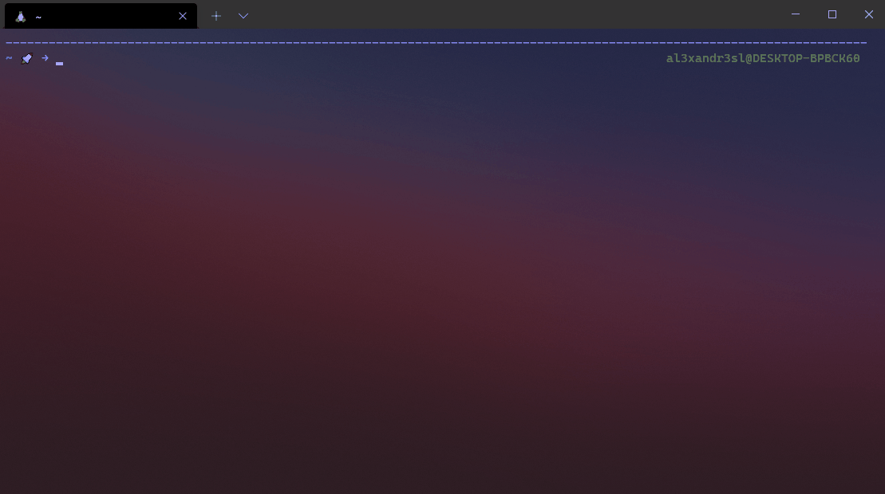

# Theme :rocket: created for the Oh My ZSH framework

[](https://github.com/Alexandresl/rocket-zsh-theme/blob/main/LICENSE)

## Rocket



## Installation

#### Clone the repository:
```
$ git clone git@github.com:Alexandresl/rocket-zsh-theme.git
```


#### Theme 
1. Copy `rocket.zsh-theme` file into the `~/.oh-my-zsh/themes/` directory.
2. Change the theme variable name to `ZSH_THEME="rocket"` in `~/.zshrc`
3. Reload ZSH with `source ~/.zshrc`

## License

[MIT License](https://github.com/Alexandresl/rocket-zsh-theme/blob/main/LICENSE)
